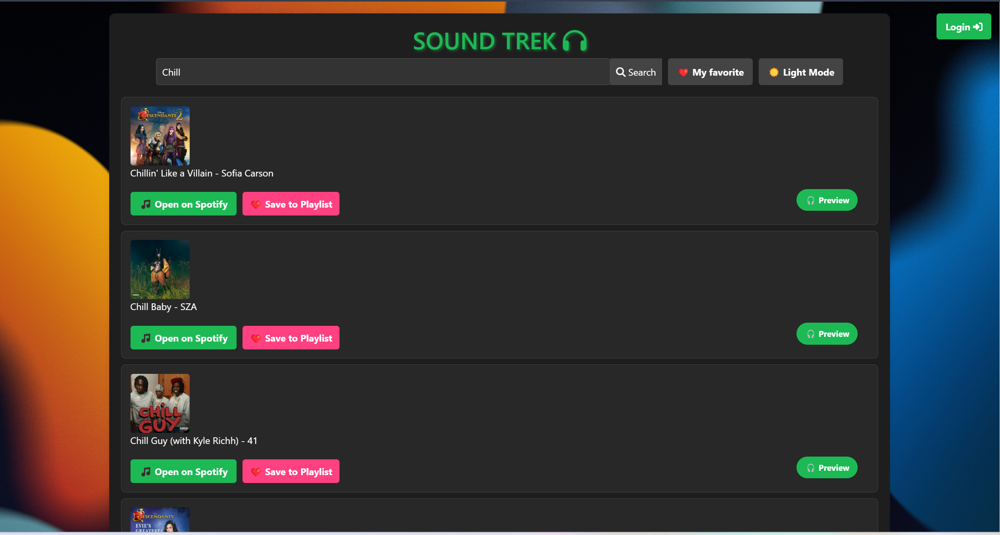

# 🎵 Sound Trek - A Personalized Music Playlist Web App

> **A modern web application that allows users to search for songs, preview tracks, create Spotify playlists, and manage favorite songs with a sleek and interactive UI.**

## 📸 Screenshots


**Sound Trek Home Page without log in**
 
**Unlimited Search Results**

**Save Favorite songs**

**Song Preview**

**Open on Spotify button**

**Light mode**

**Log in Button will navigate to Spotify Authorization page**

**Get user information and new functionalities**

**Create new playlist**

**Add favorite songs into new playlist**

**Spotify new playlist created**
## 🚀 Features

- 🔍 **Search for Songs**: Find songs from Spotify using keywords.
- 🎧 **Preview Songs**: Listen to a 30-second preview before adding to a playlist.
- ❤️ **Save to Favorites**: Add songs to your personal favorite list.
- 🎼 **Create Playlists**: Generate new Spotify playlists and add songs directly.
- 🔄 **Drag & Drop Sorting**: Reorder favorite songs in a playlist.
- 🎭 **Dark Mode**: Toggle between dark and light themes for better usability.
- 🔑 **Spotify Authentication**: Login via Spotify to access personalized playlists.

## 📂 Project Structure

```
📦 sound-trek-reactjs
├── 📂 src
│   ├── 📂 components         # UI Components (Header, SongList, FavoritePlaylist, etc.)
│   ├── 📂 services           # Spotify API authentication & data fetching
│   ├── App.css               # CSS files
│   ├── App.js                # Main app container
│   ├── index.js              # Entry point
├── 📜 .env                    # Environment variables (API keys)
├── 📜 README.md               # Documentation
├── 📜 package.json            # Dependencies and scripts
└── 📜 yarn.lock / package-lock.json  # Lock files
```

## 🛠 Technologies Used

- **React.js** - Frontend framework
- **Spotify Web API** - Fetch song data & manage playlists
- **@dnd-kit** - Drag-and-drop functionality for favorite songs
- **Bootstrap** - UI styling
- **Reactstrap** - Modal & buttons
- **dotenv** - Environment variable management

## 🏗 Installation & Setup

### 1️⃣ Clone the repository

```sh
git clone https://github.com/Kiritokunnnnn/Sound-Trek.git
cd my-react-app
```

### 2️⃣ Install dependencies

```sh
npm install  # or yarn install
```

### 3️⃣ Set up environment variables

Create a `.env` file in the root directory and add your Spotify API keys:

```sh
REACT_APP_CLIENT_ID="your_spotify_client_id"
REACT_APP_CLIENT_SECRET="your_spotify_client_secret"
REACT_APP_REDIRECT_URI="http://localhost:3000/callback"
```

### 4️⃣ Start the development server

```sh
npm start  # or yarn start
```

## 📌 Usage

- **Login** with your Spotify account to access full features.
- **Search** for your favorite songs and preview them.
- **Save** songs to your favorite list and manage them.
- **Create playlists** and add songs directly to your Spotify account.
- **Toggle dark mode** for a better user experience.

## 🛠 Future Enhancements

- 🎶 **Mood-based Recommendations** - Suggest songs based on mood detection.
- 📱 **Chat Room - Let users interact with each other.**
- 🎭 **More Themes** - Add customizable themes.
- 🔊 **Full Song Playback** - Play full songs for premium users.

## 🤝 Contributing

Pull requests are welcome! If you find any issues or have ideas for improvements, please open an issue.

## 📜 License

This project is licensed under the [MIT License](LICENSE).

---

🔥 **Enjoy your personalized music experience with Sound Trek!** 🎧

